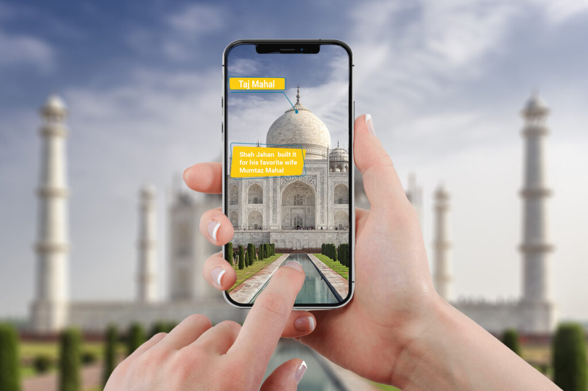

# AR-Based-India-Tour-Guide

An augmented reality (AR) application that serves as a tour guide for various tourist attractions in India. The app provides an immersive experience using AR technology to enhance the information about historical sites, landmarks, and other points of interest.

## Features

- **Augmented Reality:** Utilizes AR technology to overlay information and multimedia on real-world images.
- **Interactive Maps:** Provides interactive maps with detailed information about tourist spots.
- **Multimedia Content:** Includes videos, audio guides, and images for an enriched user experience.
- **User-Friendly Interface:** Easy-to-navigate interface for a seamless tour experience.

## Technologies Used

- **Kotlin:** Used for developing the Android application.
- **Unity:** Utilized for creating and managing the AR components.

## Getting Started

### Prerequisites

- Android Studio
- Unity
- ARCore SDK

### Installation

1. Clone the repository:
    ```sh
    git clone https://github.com/your-username/AR-Based-India-Tour-Guide.git
    ```
2. Open the project in Android Studio.
3. Sync the project with Gradle files.
4. Open the Unity project located in the `AR-Unity` directory.
5. Build the Unity project and integrate it with the Android project.

### Running the Application

1. Connect your Android device to your development machine.
2. Run the project from Android Studio.
3. The application will be installed on your device.
4. Open the app and point your camera at recognized landmarks to experience the AR features.

## Usage

- Launch the app and allow necessary permissions.
- Use the camera to scan landmarks.
- Interact with the AR elements to learn more about each tourist spot.

## Contributing

Contributions are welcome! Please fork the repository and create a pull request with your changes.


## Contact

For any questions or feedback, please contact [avanishyadavvns23@gmail.com@example.com](mailto:avanishyadav967@gmail.com@example.com).

---

### Screenshots



